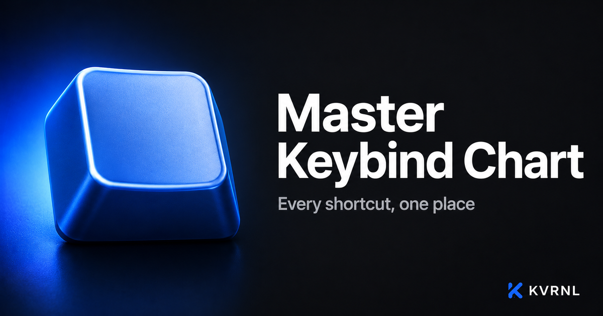

# Master Keybind Chart

### Every shortcut, one place

 

A fast, searchable reference for keyboard shortcuts across your favorite tools. Group by app, search instantly, and never forget a keybind again.

### **[⬇&nbsp; Download Master Keybind Chart — free at kvrnl.io](https://kvrnl.io/products/master-keybind-chart/)**

 

---

## What it does

Master Keybind Chart puts every keyboard shortcut you rely on in one fast, searchable place. Group by app, filter instantly, and stop hunting through menus.

Lightweight and quiet — it stays out of your way. Free to use; claim your license key and download it straight from this page.

## Features

- **Comprehensive shortcut reference**
- **Clean, searchable interface**
- **Group and filter by app**
- **Fast, lightweight, and offline**

## Download &amp; install

Master Keybind Chart is **completely free**. Each install needs its own license key, which you get
with a free KVRNL account.

1. Go to **[kvrnl.io/products/master-keybind-chart/](https://kvrnl.io/products/master-keybind-chart/)**
2. Create a free account — email verification, nothing else
3. Claim your license key — instant, no waiting
4. Download and install

> [!NOTE]
> Master Keybind Chart isn't code-signed yet, so Windows SmartScreen may warn you on first run.
> Click **More info → Run anyway**. Code signing is on the roadmap.

## Your license key

- **Free, one per product**, issued from your KVRNL account.
- **A key activates on one machine.** The first device to activate it claims it.
- **Switching computers?** Hit **Release device** on your
  [account page](https://kvrnl.io/account/) and the key is free to use again.
- Keys are checked over HTTPS at launch. See [Privacy](#privacy).

## Requirements

- **Windows 10 or 11** (64-bit)
- A free [KVRNL account](https://kvrnl.io/signup/) for your license key

## Privacy

Master Keybind Chart sends KVRNL only what's needed to validate your license: **the key, the
product name, and a hardware ID**. No telemetry, no analytics, no tracking, and
none of your files. Full policy: **[kvrnl.io/privacy](https://kvrnl.io/privacy/)**

## What's new

**v2.0.7** — 2026-09-26
  - When the app checks your license, it now also says which version you're running and whether it's just starting up.
  - The app now shares basic usage info with KVRNL, like which features you use and basic PC details such as your Windows version and screen size. It never sends what you type into keys, your profile names or your files. You can turn it off any time in Settings, under Your data.

**v2.0.6** — 2026-09-25
  - New activation screen with clear steps for getting your free key: create a KVRNL account, get the app from its page, then copy your key from My account. Each step has a button that opens the right page.
  - Pasting your key is easier: there's a Paste button, and keys are cleaned up automatically even if you copy extra text or spaces along with them.
  - When a key can't be activated, you now see exactly why, with a button that takes you straight to the fix.
  - A short outage on the license server no longer locks you out. You can keep working offline for up to 14 days between checks.
  - If checking your license takes a moment at startup, a small window now tells you so instead of nothing appearing.
  - Stronger license protection: the app stays fully locked until your key is confirmed.
  - Fixed: after closing the getting-started tip, the keyboard could flicker between two sizes nonstop. It now stays steady at every window size.
  - If the window is very small, the keyboard now scrolls instead of getting cut off at the edges.

**v2.0.5** — 2026-09-06
  - Fixed: the app name in the top-left corner was squashed onto one line. It now sits cleanly on two.

**v2.0.4** — 2026-09-06
  - Completely rebuilt layout. The keyboard now auto-fits your window, so nothing gets cut off at the edges no matter the size.
  - New editing flow: click any key and a small editor pops up next to it. Enter saves, Tab jumps to the next key, Esc cancels. You can see what you're typing on the key as you go.
  - Layers: record what a key does while Shift, Ctrl or Alt is held. Small coloured dots show which keys have combos.
  - Profiles moved to a side panel with rename, duplicate, export and delete. Every profile shows how many keys it has bound.
  - New Bindings list under the keyboard shows everything in the current profile. Click a row to jump to that key, or copy the whole chart as plain text.
  - Search: type a key or an action and matching keys light up while everything else dims.
  - Settings panel: 9 themes, effects, text size, keyboard layout (Compact / TKL with arrows / Full with numpad), auto-fit or manual key size, and editing preferences.
  - Report a problem from inside the app (Settings), with an optional screenshot. Check for updates from Settings too.
  - Undo: clearing a key, clearing everything, importing, and deleting a profile can all be undone from the popup that appears.
  - Import now understands files from older versions, new profile files, and full backups. Settings has a one-click backup of every profile.
  - Your existing profiles, bindings, theme and effect carry over automatically.

**v2.0.3** — 2026-09-05
  - Fixed: creating a new profile from the profile dropdown did nothing. It now opens a small name box in the app and works.
  - Fixed: clicking anywhere on a key now starts editing it, not just the lower half.
  - Fixed: pasting text into a key now pastes plain text on one line, so nothing odd gets stuck in the key.
  - Fixed: the right-click menu no longer runs off the edge of the window.
  - Fixed: Import now trims anything too long to fit on a key, the same as typing does.
  - Fixed: the Quit button on the activation screen had a bright cyan outline. It's the intended subtle grey now.
  - Fixed: pressing Enter twice on the activation screen could send the activation twice.
  - Removed the Share button. It copied a link that only worked on your own PC. Use Export to share a layout.
  - Under the hood: smoother license checks, and a couple of startup edge cases tightened up.

Full history → **[kvrnl.io/changelog/master-keybind-chart](https://kvrnl.io/changelog/master-keybind-chart/)**

## Documentation

Setup guides and how-tos → **[kvrnl.io/docs/master-keybind-chart](https://kvrnl.io/docs/master-keybind-chart/)**

## Support

> [!IMPORTANT]
> **We don't use GitHub Issues.** Report bugs from inside the app — it's the
> fastest route to us and it attaches the details we need automatically.

- 🐛 **Found a bug?** Use **Report a Problem** inside Master Keybind Chart
- 💬 **Chat with us** → **[Discord](https://discord.gg/Ub4SdAuhu)**
- ✉️ **Anything else** → **[kvrnl.io/contact](https://kvrnl.io/contact/)**
- ❓ **FAQ** → [kvrnl.io/faq](https://kvrnl.io/faq/)

## License

**Proprietary freeware — free to use, not open source.**

This repository hosts the installer releases, documentation, and license for
Master Keybind Chart. **The application source code is not published.** See
**[LICENSE](./LICENSE)** for the full terms.

---

 

**[kvrnl.io](https://kvrnl.io)** &nbsp;·&nbsp; **[All products](https://kvrnl.io/products/)** &nbsp;·&nbsp; **[Changelog](https://kvrnl.io/changelog/)** &nbsp;·&nbsp; **[Discord](https://discord.gg/Ub4SdAuhu)** &nbsp;·&nbsp; **[Contact](https://kvrnl.io/contact/)**

© 2026 <b>KVRNL</b> — an AI-powered software studio shipping free desktop tools.

